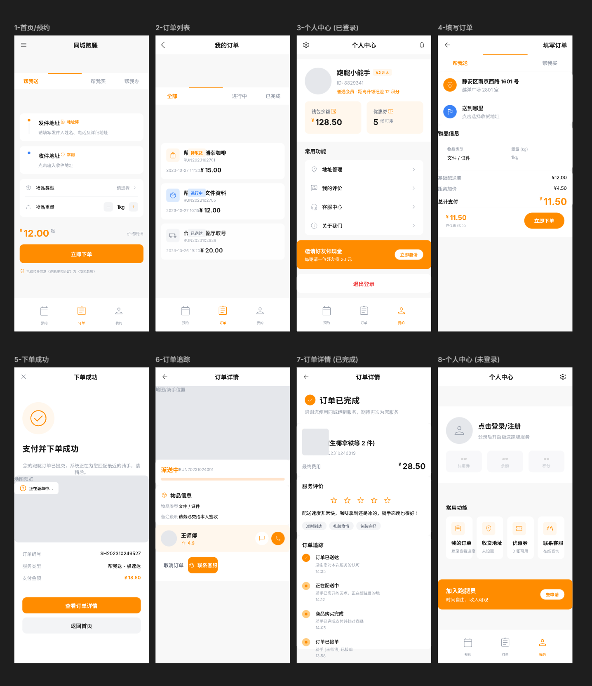
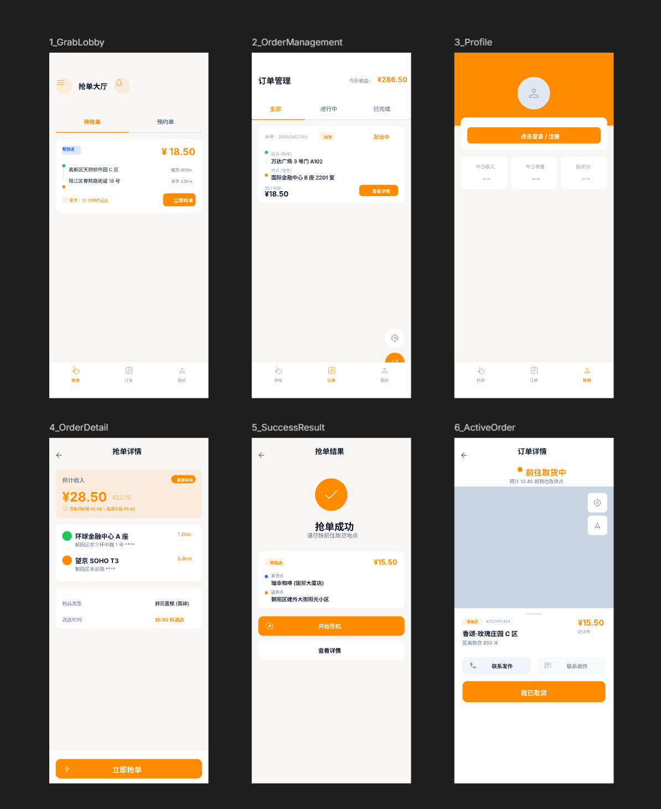

<div align="center">

# 🚀 Delivery Mini App

### WeChat Delivery Mini Program

[](https://developers.weixin.qq.com/miniprogram/dev/framework/)
[](https://uniapp.dcloud.net.cn/)
[](https://vuejs.org/)
[](LICENSE)
[](https://uniapp.dcloud.net.cn/uniCloud/)

*A full-featured delivery platform connecting users and riders for seamless delivery experience*

*[中文](./README.md)*

</div>

---

## 📋 Overview

Delivery Mini App is a comprehensive WeChat delivery platform that connects customers who need delivery services with delivery riders. Built with **uniapp** and **Vue.js**, the application provides two dedicated clients:

- **User App** - Place orders, manage orders, real-time tracking
- **Rider App** - Order lobby, delivery management, earnings statistics

The project leverages **uniCloud** (Aliyun) for serverless backend services, enabling real-time order matching, status tracking, and seamless communication between both parties.

---

## 📱 Screenshots

### User App



### Rider App



---

## 🎨 Design Prototypes

The UI design prototypes for this project were built using **Pencil MCP** tool. Pencil is a professional design file tool that supports:

- **Cross-platform Design** - Output Web, iOS, Android designs simultaneously
- **Team Collaboration** - Seamless design-development workflow
- **Code Generation** - Export component code for various development frameworks

### Design Files Location

| Application | Design File |
|-------------|-------------|
| User App | `user-app/pencil-user.pen` |
| Rider App | `rider-app/pencil-rider.pen` |

> **Note**: `.pen` files can be opened with Pencil tool. Download from [Pencil Official Website](https://pencil.evolus.vn/).

---

## ✨ Features

### 🧑‍💼 User App (`user-app/`)

| Feature | Description |
|---------|-------------|
| 📍 **Location Services** | GPS positioning and map integration for precise delivery addresses |
| 📝 **Order Creation** | Intuitive order forms with item details, delivery address, and notes |
| 📦 **Order Tracking** | Real-time order status updates from placement to completion |
| 📋 **Order History** | Complete order history with filtering and search capabilities |
| 💳 **Payment Integration** | Seamless payment flow for order settlement |
| ⭐ **Rating System** | Post-delivery ratings and feedback for riders |
| 👤 **Profile Management** | User profile, addresses, and preferences management |

**Pages**: Home, Create Order, Order Success, Order List, Order Detail, Profile, Reservation, Mine

### 🛵 Rider App (`rider-app/`)

| Feature | Description |
|---------|-------------|
| 🎯 **Order Lobby** | Browse and filter available delivery orders |
| 📲 **One-Click Accept** | Quick order acceptance with haptic feedback |
| 📊 **Order Management** | Active order tracking and history management |
| 💰 **Earnings Dashboard** | Real-time income tracking and statistics |
| 🗺️ **Navigation** | Built-in map navigation to delivery locations |
| 👤 **Profile Settings** | Rider profile, availability status, and preferences |

**Pages**: Home (Order Lobby), Active Order, Order Detail, Order History, Profile, Rider Code, Success

### 🔄 Common Components

- **BottomNav** - Customizable bottom navigation bar
- **OrderCard** - Reusable order display card
- **TabBar** - Custom tab bar component

---

## 🛠️ Tech Stack

| Category | Technology |
|----------|------------|
| Framework | [uniapp](https://uniapp.dcloud.net.cn/) - Cross-platform mini program framework |
| Language | [Vue.js 2.x](https://vuejs.org/) - Progressive JavaScript framework |
| Platform | WeChat Mini Program |
| Backend | [uniCloud](https://uniapp.dcloud.net.cn/uniCloud/) - Serverless cloud services (Aliyun) |
| Database | NoSQL (uniCloud MongoDB-compatible) |
| UI Components | uni-ui, SCSS |
| Build Tool | HBuilderX |
| Design Tool | Pencil MCP |

---

## 📁 Project Structure

```
delivery-mini-app/
│
├── 📦 user-app/                    # Customer-side application
│   ├── 📄 pages/                   # Page components
│   │   ├── index/                  # Home page
│   │   ├── create-order/           # Order creation
│   │   ├── order-success/          # Order confirmation
│   │   ├── orders/                 # Order list
│   │   ├── order/                  # Order detail
│   │   ├── profile/                # User profile
│   │   ├── reservation/            # Scheduled deliveries
│   │   └── mine/                   # Personal center
│   │
│   ├── 🧩 components/              # Reusable components
│   │   ├── BottomNav/              # Bottom navigation
│   │   ├── OrderCard/             # Order card component
│   │   └── TabBar/                # Tab bar
│   │
│   ├── 📁 static/                  # Static assets
│   │   ├── user-image.png          # User app preview
│   │   └── tabbar/                 # Tab bar icons
│   │
│   ├── ✏️ pencil-user.pen           # Pencil design prototype
│   │
│   ├── ☁️ uniCloud-aliyun/          # Cloud functions & database
│   │   ├── cloudfunctions/         # Serverless functions
│   │   └── database/              # Database schemas
│   │
│   └── 📄 Configuration
│       ├── manifest.json           # App configuration
│       ├── pages.json              # Page routing
│       └── main.js                 # Entry point
│
├── 🛵 rider-app/                   # Rider-side application
│   ├── 📄 pages/
│   │   ├── index/                  # Home / Order lobby
│   │   ├── active-order/          # Current delivery
│   │   ├── detail/                # Order detail
│   │   ├── orders/                # Order history
│   │   ├── profile/               # Rider profile
│   │   ├── rider-code/            # QR code for customers
│   │   └── success/               # Delivery complete
│   │
│   ├── 🧩 components/
│   │   └── BottomNav/
│   │
│   ├── 📁 static/
│   │   └── rider-image.png        # Rider app preview
│   │
│   ├── ✏️ pencil-rider.pen         # Pencil design prototype
│   │
│   ├── ☁️ uniCloud-aliyun/
│   └── 📄 Configuration files
│
├── 📝 README.md                    # Chinese README
├── 📝 README_en.md                 # English README
└── 📝 .gitignore                   # Git ignore rules
```

---

## 🚦 Getting Started

### Prerequisites

| Requirement | Description |
|-------------|-------------|
| **HBuilderX** | Official uniapp IDE, required. [Download](https://www.dcloud.io/hbuilderx.html) |
| WeChat DevTools | WeChat mini program simulator. [Download](https://developers.weixin.qq.com/miniprogram/en/dev/devtools/download.html) |
| WeChat Account | Registered mini program (AppID). [WeChat Official Accounts Platform](https://mp.weixin.qq.com/) |

### Installation & Run

```bash
# 1. Clone the repository
git clone https://github.com/NeoWeb3Nova/delivery-mini-app.git
cd delivery-mini-app

# 2. Open in HBuilderX
# File -> Open Directory -> Select user-app or rider-app

# 3. Run the application
# Click "Run" -> "Run to Mini Program Simulator" -> "WeChat DevTools"
```

### WeChat Configuration

1. Download and install [WeChat Developer Tools](https://developers.weixin.qq.com/miniprogram/en/dev/devtools/download.html)
2. Register a mini program at [WeChat Official Accounts Platform](https://mp.weixin.qq.com/)
3. Obtain your AppID
4. Configure `manifest.json` with your AppID
5. Set WeChat DevTools path in HBuilderX preferences

---

## ☁️ Cloud Functions

### User App
- `order` - Create and manage delivery orders

### Rider App
- `get-order` - Fetch available orders for riders

---

## 🤝 Contributing

Contributions are welcome! Please follow these steps:

### Development Workflow

1. **Install Environment**
   - Download and install [HBuilderX](https://www.dcloud.io/hbuilderx.html)
   - Download and install [WeChat Developer Tools](https://developers.weixin.qq.com/miniprogram/en/dev/devtools/download.html)

2. **Fork the Project**
   - Click the Fork button in the top right corner

3. **Clone the Project**
   ```bash
   git clone https://github.com/your-username/delivery-mini-app.git
   cd delivery-mini-app
   ```

4. **Create a Branch**
   ```bash
   # User app feature
   git checkout -b feature/user-app-feature-name

   # Rider app feature
   git checkout -b feature/rider-app-feature-name

   # Bug fix
   git checkout -b fix/description
   ```

5. **Develop and Test**
   - Open `user-app` or `rider-app` directory in HBuilderX
   - Make changes and run in WeChat DevTools for preview

6. **Commit Changes**
   ```bash
   git add .
   git commit -m 'Describe your changes'
   ```

7. **Push Branch**
   ```bash
   git push origin your-branch-name
   ```

8. **Create PR**
   - Create a Pull Request on GitHub
   - Describe your changes clearly

### Code Standards

- Use Vue 2.x syntax
- Follow uniapp component conventions
- Use lowercase and hyphens for page/component names
- Cloud functions use JavaScript

### Notes

- Ensure code runs properly before submitting PR
- If modifying cloud functions, include database schema changes
- Update README if adding new features

---

## 📄 License

This project is licensed under the MIT License - see the [LICENSE](LICENSE) file for details.

---

## 📞 Support

If you encounter any issues or have questions:

- 🐛 [Open an Issue](https://github.com/NeoWeb3Nova/delivery-mini-app/issues)
- 💬 Discussion: Start a discussion

---

<div align="center">

**⭐ Star this repository if you find it helpful!**

Built with ❤️ using uniapp + Vue.js

</div>